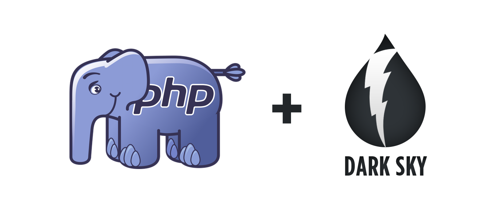

# Dark Sky API

[](https://patreon.com/dmitryivanov)

[](https://github.styleci.io/repos/148543382)
[](https://travis-ci.com/dmitry-ivanov/dark-sky-api)
[](https://coveralls.io/github/dmitry-ivanov/dark-sky-api?branch=master)

[](https://packagist.org/packages/dmitry-ivanov/dark-sky-api)
[](https://packagist.org/packages/dmitry-ivanov/dark-sky-api)
[](https://packagist.org/packages/dmitry-ivanov/dark-sky-api)
[](https://packagist.org/packages/dmitry-ivanov/dark-sky-api)

The package provides a convenient way to interact with [Dark Sky API](https://darksky.net/dev/docs).

It covers all the API functionality, including object-level access to the [response headers](https://darksky.net/dev/docs#response-headers), [weather alerts](https://darksky.net/dev/docs#alerts) and [flags](https://darksky.net/dev/docs#flags).

- Requires [PHP 5.6+](https://php.net/releases/#5.6.0).
- [Stand-alone](#basic-usage) PHP package.
- Ready-to-use in [Laravel](#laravel-support) application.
- Each request utilizes [HTTP compression](https://darksky.net/dev/docs#response-notes).
- [Time Machine Requests](https://darksky.net/dev/docs#time-machine-request) are sent concurrently.

## Installation

Use [Composer](https://getcomposer.org) to install the package:

```bash
composer require dmitry-ivanov/dark-sky-api
```

## Basic Usage

### Forecast Request

```php
use DmitryIvanov\DarkSkyApi\DarkSkyApi;

$forecast = (new DarkSkyApi('secret-key'))
    ->location(46.482, 30.723)
    ->units('si')
    ->language('ru')
    ->forecast('currently');

echo $forecast->currently()->summary();
```

### Time Machine Requests

```php
use DmitryIvanov\DarkSkyApi\DarkSkyApi;

$timeMachine = (new DarkSkyApi('secret-key'))
    ->location(46.482, 30.723)
    ->units('si')
    ->language('ru')
    ->timeMachine('2018-12-01', ['daily', 'flags']);

echo $timeMachine->daily()->summary();
```

Multiple requests are sent concurrently:

```php
use DmitryIvanov\DarkSkyApi\DarkSkyApi;

$timeMachine = (new DarkSkyApi('secret-key'))
    ->location(46.482, 30.723)
    ->timeMachine(['2018-12-01', '2018-12-02', '2018-12-03']);

echo $timeMachine['2018-12-02']->daily()->summary();
```

## Laravel Support

> If you're using Laravel <5.5, you have to register the service provider and alias by yourself.

The package utilizes [Laravel Package Discovery](https://laravel.com/docs/master/packages#package-discovery), so you'll get the service provider and alias registered out-of-the-box.

Set your [Secret Key](https://darksky.net/dev/register) in `.env` file:

```dotenv
DARK_SKY_KEY="Your Secret Key"
```

You may use the configured facade now:

```php
use DarkSkyApi;

$forecast = DarkSkyApi::location(46.482, 30.723)
    ->units('si')
    ->language('ru')
    ->forecast('currently');

echo $forecast->currently()->summary();
```

Publish the config file to override request parameters (optionally):

```bash
php artisan vendor:publish --provider="DmitryIvanov\DarkSkyApi\Adapters\Laravel\DarkSkyApiServiceProvider"
```

## Further Reading

You can find more information in [my article](https://medium.com/@dmitry.g.ivanov/weather-forecast-in-php-95bca6b0ed18) entirely dedicated to this Library.

## License

Dark Sky API is open-sourced software licensed under the [MIT license](LICENSE.md).

[](https://patreon.com/dmitryivanov)
