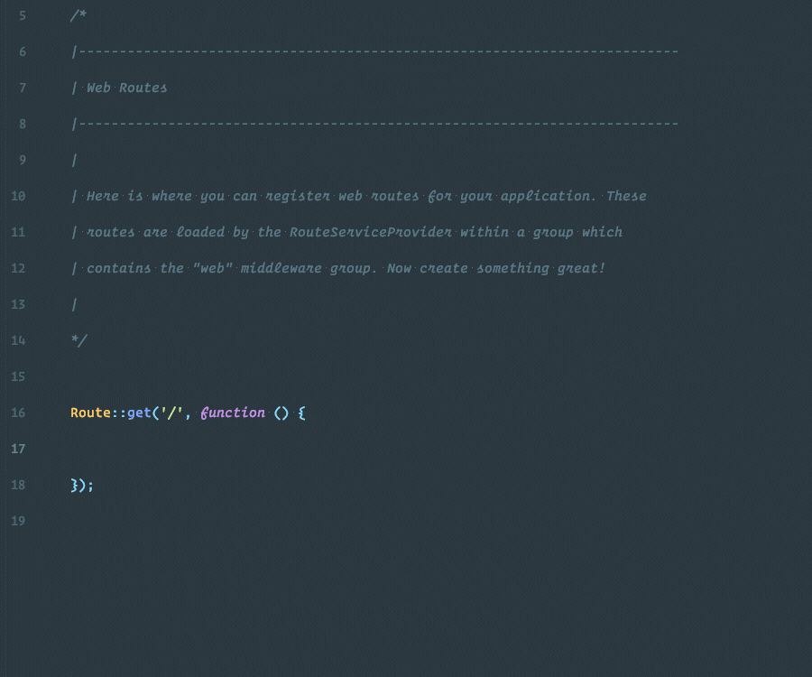

# Dark Sky API

[](https://patreon.com/dmitryivanov)

[](https://github.styleci.io/repos/148543382)
[](https://travis-ci.com/dmitry-ivanov/dark-sky-api)
[](https://coveralls.io/github/dmitry-ivanov/dark-sky-api?branch=master)

[](https://packagist.org/packages/dmitry-ivanov/dark-sky-api)
[](https://packagist.org/packages/dmitry-ivanov/dark-sky-api)
[](https://packagist.org/packages/dmitry-ivanov/dark-sky-api)
[](https://packagist.org/packages/dmitry-ivanov/dark-sky-api)

PHP Library for the [Dark Sky API](https://darksky.net/dev/docs).



## Usage

1. Install the package via Composer:

    ```shell script
    composer require dmitry-ivanov/dark-sky-api
    ```

2. Use the `DmitryIvanov\DarkSkyApi\DarkSkyApi` class:

    ```php
    use DmitryIvanov\DarkSkyApi\DarkSkyApi;

    $forecast = (new DarkSkyApi('secret-key'))
        ->location(46.482, 30.723)
        ->forecast('daily');

    echo $forecast->daily()->summary();
    ```

## Time Machine Requests

Sometimes it might be useful to get weather for the specified date:

```php
$timeMachine = (new DarkSkyApi('secret-key'))
    ->location(46.482, 30.723)
    ->timeMachine('2020-01-01', 'daily');

echo $timeMachine->daily()->summary();
```

You can also get weather for multiple dates:

```php
$timeMachine = (new DarkSkyApi('secret-key'))
    ->location(46.482, 30.723)
    ->timeMachine(['2020-01-01', '2020-01-02', '2020-01-03'], 'daily');

echo $timeMachine['2020-01-02']->daily()->summary();
```

## Usage in Laravel

> If you're using Laravel <5.5, you have to register service provider and alias by yourself!

1. Publish the config:

    ```shell script
    php artisan vendor:publish --provider="DmitryIvanov\DarkSkyApi\Adapters\Laravel\DarkSkyApiServiceProvider"
    ```

2. Set your secret key in the `.env` file:

    ```dotenv
    DARK_SKY_KEY="Your-Secret-Key"
    ```

3. Use the `DarkSkyApi` facade:

    ```php
    use DarkSkyApi;

    $forecast = DarkSkyApi::location(46.482, 30.723)
        ->forecast('daily');

    echo $forecast->daily()->summary();
    ```

## Learn more

You can find more information in [my article](https://medium.com/@dmitry.g.ivanov/weather-forecast-in-php-95bca6b0ed18).

## License

Dark Sky API is open-sourced software licensed under the [MIT license](LICENSE.md).

[](https://patreon.com/dmitryivanov)
